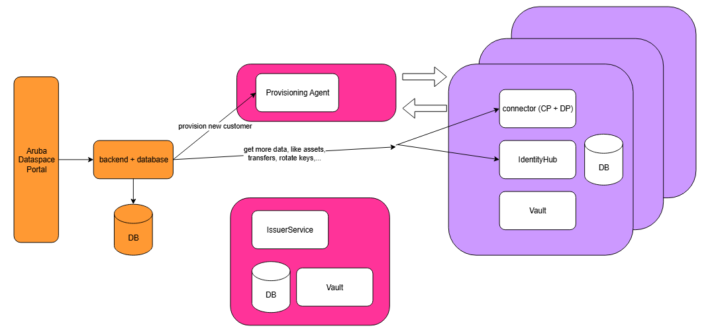
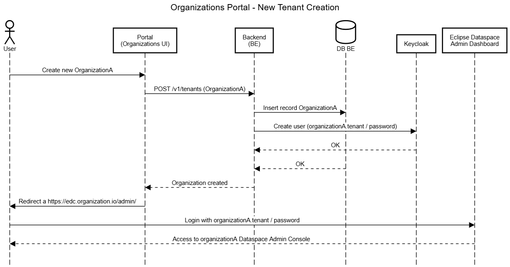
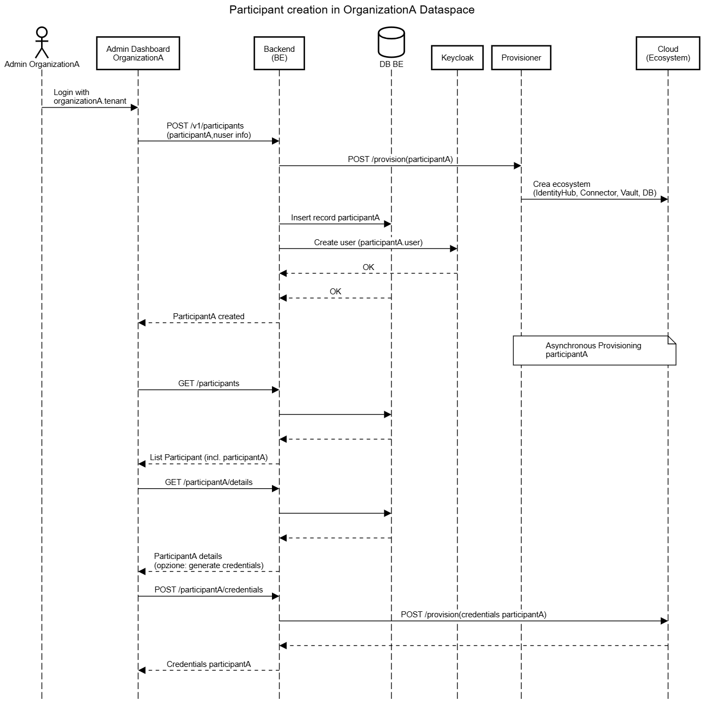
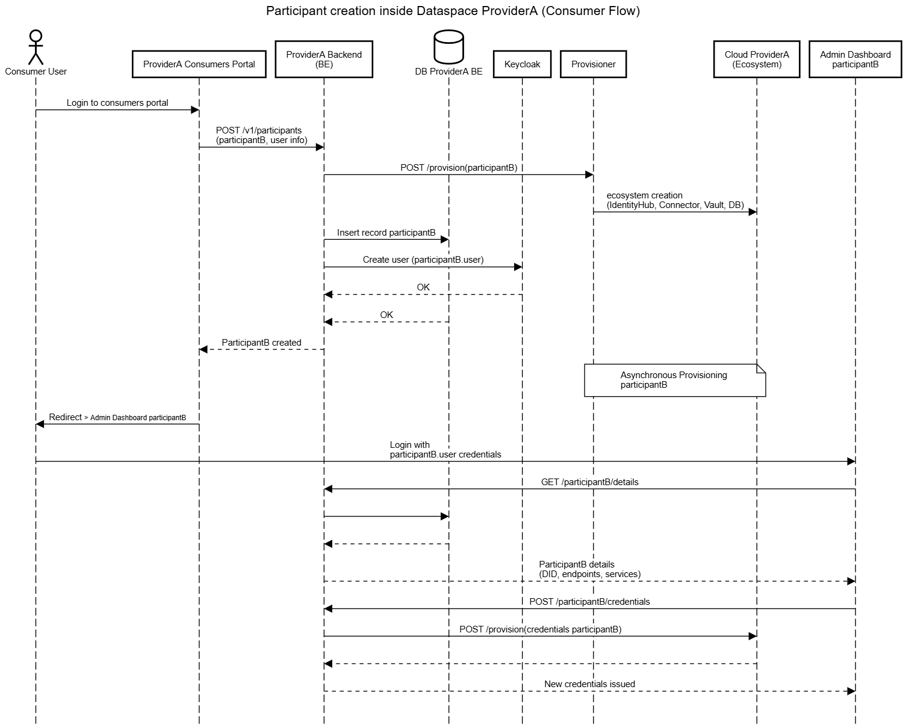

# EDC Management API

Spring Boot backend for managing tenants and participants in a dataspace based on Eclipse Dataspace Connector (EDC).
The system provides a REST interface for creating, managing, and provisioning organizations (tenants) and participants in the dataspace, integrating with external services for cloud infrastructure provisioning and credential management.

## 📋 Table of Contents

- [Overview](#overview)
- [Architecture](#architecture)
- [Core Features](#core-features)
- [API Endpoints](#api-endpoints)
- [Operational Flows](#operational-flows)
- [Security](#security)
- [Configuration](#configuration)
- [Running the Application](#running-the-application)
- [API Documentation](#api-documentation)

## 🎯 Overview

This backend is part of a **Proof of Concept based on Eclipse Dataspace Connector (EDC)** and is responsible for orchestrating the creation and management of participants in a multi-tenant dataspace.

### PoC Context

Within an EDC-based dataspace, the portal manages:

- **Tenant (Organizations/Providers)**: Each tenant represents a **dataspace provider**. It defines the administrative boundary within which participants will operate.
- **Participant**: Entities that access and participate in the dataspace. Each participant is associated with:
    - Its own **IdentityHub** (decentralized identity management)
    - A **Connector** (Control Plane + Data Plane)
    - Vertical storage resources (**dedicated databases**)
    - A **Vault** for secure credential management

### PoC Architecture



The PoC implements a clear separation between:

- **Base infrastructure**: IssuerService + Provisioner, deployed once for the dataspace
- **Participant-specific infrastructure**: IdentityHub, control plane, data plane, database, vault - created for each participant onboarding through the **Provisioner** component

The backend manages the complete lifecycle of:

- **Tenant (Organizations)**: Creation, management, and multi-tenant isolation
- **Participant**: Asynchronous provisioning with complete cloud ecosystem creation
- **Credentials**: Management of verifiable credentials (MembershipCredential, DataProcessorCredential)
- **Operations**: Tracking of asynchronous provisioning and deprovisioning operations

### PoC Integration

The system integrates with:

- **Keycloak**: For user authentication and authorization
- **Provisioner**: External service for provisioning cloud ecosystems (IdentityHub, Connector, Vault, DB) on Kubernetes clusters
- **External API**: For managing verifiable credentials through Identity API

This architecture enables the implementation of **interoperability** and **data sovereignty** scenarios typical of European dataspace initiatives (GAIA-X, Catena-X, etc.).

## 🏗️ Architecture

The system is based on Spring Boot 3.4.5 and uses:

- **Spring Security** with OAuth2 Resource Server (JWT)
- **Spring Data JPA** for persistence (supports MySQL and H2)
- **SpringDoc OpenAPI** for API documentation
- **Lombok** to reduce boilerplate code

### Main Components

```
src/main/java/edc/
├── controller/          # REST Controllers
│   ├── TenantController.java
│   ├── ParticipantController.java
│   └── SignupController.java
├── service/            # Business Logic
│   ├── TenantService.java
│   ├── ParticipantService.java
│   ├── CredentialService.java
│   └── OperationService.java
├── entity/            # JPA Entities
│   ├── Tenant.java
│   ├── Participant.java
│   ├── Credential.java
│   └── Operation.java
├── dto/               # Data Transfer Objects
└── config/            # Configuration Classes
    ├── SecurityConfig.java
    └── OpenApiConfig.java
```

## ⚙️ Core Features

### Tenant Management

- **Create Tenant**: Create new organizations in the dataspace
- **List Tenants**: Paginated retrieval with filters (name, status)
- **Get Tenant Details**: Retrieve information for a specific tenant
- **Update Tenant**: Modify description and metadata
- **Delete Tenant**: Soft delete of the tenant
- **Current Tenant**: Retrieve the tenant associated with the authenticated user

### Participant Management

- **Create Participant**: Initiate asynchronous provisioning of a new participant
- **List Participants**: Paginated retrieval with filters (current operation, name)
- **Get Participant Details**: Retrieve complete information (DID, host, endpoints)
- **Update Participant**: Modify description and metadata
- **Delete Participant**: Initiate asynchronous deprovisioning
- **Current Participant**: Retrieve the participant associated with the authenticated user

### Credential Management

- **Request Credentials**: Request verifiable credentials for a participant
- **List Credentials**: Paginated retrieval of participant credentials
- **Get Credential Details**: Retrieve information for a specific credential
- **Credential Statuses**: REQUESTED, ISSUED, REVOKED, EXPIRED

### Operation Tracking

- **Operation History**: Retrieve the operation history for a participant
- **Event Types**: Tracking of provisioning, deprovisioning, and other operations
- **Operation Statuses**: PROVISION_IN_PROGRESS, ACTIVE, DEPROVISION_IN_PROGRESS, etc.

## 🔌 API Endpoints

### Tenant Management

| Method | Endpoint | Description | Required Roles |
|--------|----------|-------------|----------------|
| `POST` | `/v1/tenants` | Create a new tenant | `EDC_ADMIN` |
| `GET` | `/v1/tenants` | List all tenants | `EDC_ADMIN` |
| `GET` | `/v1/tenants/{tenantId}` | Retrieve a tenant | `EDC_ADMIN`, `EDC_ADMIN_TENANT` |
| `PUT` | `/v1/tenants/{tenantId}` | Update a tenant | `EDC_ADMIN`, `EDC_ADMIN_TENANT` |
| `DELETE` | `/v1/tenants/{tenantId}` | Delete a tenant | `EDC_ADMIN` |
| `GET` | `/v1/tenants/me` | Retrieve current tenant | `EDC_ADMIN_TENANT` |

### Signup

| Method | Endpoint | Description | Required Roles |
|--------|----------|-------------|----------------|
| `POST` | `/v1/signup` | Signup a new tenant | `EDC_ADMIN` |

### Participant Management

| Method | Endpoint | Description | Required Roles |
|--------|----------|-------------|----------------|
| `POST` | `/v1/participants` | Create a new participant | `EDC_ADMIN`, `EDC_ADMIN_TENANT` |
| `GET` | `/v1/participants` | List all participants | `EDC_ADMIN`, `EDC_ADMIN_TENANT` |
| `GET` | `/v1/participants/{participantId}` | Retrieve a participant | `EDC_ADMIN`, `EDC_ADMIN_TENANT` |
| `PATCH` | `/v1/participants/{participantId}` | Update a participant | `EDC_ADMIN`, `EDC_ADMIN_TENANT` |
| `DELETE` | `/v1/participants/{participantId}` | Delete a participant | `EDC_ADMIN`, `EDC_ADMIN_TENANT` |
| `GET` | `/v1/participants/me` | Retrieve current participant | `EDC_USER_PARTICIPANT` |

### Credential Management

| Method | Endpoint | Description | Required Roles |
|--------|----------|-------------|----------------|
| `POST` | `/v1/participants/{participantId}/credentials` | Request credentials | `EDC_ADMIN`, `EDC_ADMIN_TENANT`, `EDC_USER_PARTICIPANT` |
| `GET` | `/v1/participants/{participantId}/credentials` | List credentials | `EDC_ADMIN`, `EDC_ADMIN_TENANT`, `EDC_USER_PARTICIPANT` |
| `GET` | `/v1/participants/{participantId}/credentials/{credentialId}` | Retrieve a credential | `EDC_ADMIN`, `EDC_ADMIN_TENANT`, `EDC_USER_PARTICIPANT` |

### Operations

| Method | Endpoint | Description | Required Roles |
|--------|----------|-------------|----------------|
| `GET` | `/v1/participants/{participantId}/operations` | Operation history | `EDC_ADMIN`, `EDC_ADMIN_TENANT`, `EDC_USER_PARTICIPANT` |

## 🔄 Operational Flows

The system supports **three main usage scenarios**:

### Scenario 1: B2B Dataspace Provider - Tenant/Organization Creation



**Context**: A user wants to create a new organization (tenant) that will become a dataspace provider.

**Flow:**
1. The user accesses the **Organizations Portal** and fills out the form to create a new organization (e.g., "organizationA")
2. The portal sends `POST /v1/tenants` (or `POST /v1/signup`) with the identifying data of the new organization
3. The backend, within the same operation, executes:
    - Persistence of the organizationA record in the internal database
    - Creation of the user in Keycloak with username `<organizationName>.tenant` and a generic password
4. Once the DB and Keycloak operations have succeeded, the backend responds with success
5. The portal redirects to the **dataspace administration dashboard** (e.g., `https://edc-organizationA.io/admin/`)
6. The user (administrator of organizationA) authenticates with the newly created credentials and accesses the administration panel

**Note**: The name entered for the tenant is **normalized** - all characters except letters and numbers are removed. For example, entering "organization.step-1" will create a tenant "organizationstep1".

### Scenario 2: Tenant Admin - Participant Creation from Tenant Console



**Context**: The administrator of a tenant (organizationA) wants to create a new participant in their dataspace.

**Flow:**
1. The organizationA admin authenticates on the dataspace dashboard (login with `organizationA.tenant`)
2. In the administration interface, selects "Create new participant" and provides:
    - **Participant identifying data**: name, DID, initial configurations, deployment host
    - **Administrative user data**: username, password that will be able to access the participant console
3. The interface sends `POST /v1/participants` with both sets of information
4. The backend handles the following actions in parallel/coordinated:
    - Saves the participant record in the database
    - Creates the participant administrative user in Keycloak
    - Invokes the **Provisioner** (via REST) with participant data (name, DID, host, configurations) to initiate cloud provisioning
5. The Provisioner receives the request and **asynchronously** deploys the complete ecosystem for the participant on cloud:
    - Creation of IdentityHub, connector, vault, database, configurations, Kubernetes namespace, service, ingress, etc.
6. The backend responds to the dashboard with a "creating" status for the participant
7. At a later time, the admin on the dashboard can:
    - Request the list of all participants in the organization (`GET /v1/participants`)
    - View the details of a specific participant (`GET /v1/participants/{participantId}`)
    - From the details, request the generation of new credentials (`POST /v1/participants/{participantId}/credentials`)

**Provisioner Integration**: The backend calls the Provisioner with a request like:
```bash
POST http://<provisioner-host>/provisioner/api/v1/resources
{
  "participantName": "participantA",
  "did": "did:web:identityhub.participantA.svc.cluster.local%3A7083:participantA",
  "kubeHost": "<kubeHost>"
}
```

### Scenario 3: Participant Provider - Reseller Model (Consumer Flow)



**Context**: In this reseller model, the dataspace manager offers a shared dataspace. Users do not need to purchase or manage a dedicated tenant, but can create a participant directly within the provider's dataspace.

**Flow:**
1. The user accesses the **consumers portal** and initiates the request to create a new participant (e.g., participantB)
2. In the interface, selects "Get Started" and provides:
    - Participant identifying data (name, DID, initial configurations, deployment host)
    - Administrative user data (username, password) that will be able to access the participant console
3. The request is forwarded to the backend, which handles:
    - Persistence of the participant in the database
    - Creation of the associated user in Keycloak
    - REST call to the Provisioner, which triggers the asynchronous deployment of the participant ecosystem (IdentityHub, Connector, Vault, DB) in the cloud
4. At the end of the initial phase, the user is **not redirected** to the tenant administration dashboard (as in previous scenarios), but to the **participant's own dashboard** that was just created
5. In this participant administration console, the user can:
    - View the details of their participant (DID, deployed services, namespace, endpoints, configurations)
    - Manage the list of active services and monitor the provisioning status
    - Request the generation and release of new verified credentials

## 🔐 Security

### Authentication

The system uses **OAuth2 Resource Server** with JWT tokens issued by Keycloak.

### Authorization

The system implements a role-based model using Spring Security:

- **`EDC_ADMIN`**: Global administrator, can manage all tenants and participants
- **`EDC_ADMIN_TENANT`**: Tenant administrator, can manage only their own tenant and its participants
- **`EDC_USER_PARTICIPANT`**: Participant user, can view only their own participant and its credentials

### Multi-tenancy

The system implements multi-tenant isolation:
- Tenant admins can see only participants from their own tenant (extracted from JWT claim `tenantName`)
- Participant users can see only their own participant (extracted from JWT claims `name` and `tenantName`)

### CORS

Customizable CORS configuration to allow requests from specific frontends.

## ⚙️ Configuration

### Configuration Files

- `application.yml`: Base configuration (uses H2 in-memory)
- `application-dev.yml`: Development configuration (uses MySQL)
- `application-test.yml`: Test configuration

### Main Properties

```yaml
spring:
  security:
    oauth2:
      resourceserver:
        jwt:
          issuer-uri: https://identity.io/realms/edc

server:
  port: 8089

springdoc:
  api-docs:
    path: /v3/api-docs
  swagger-ui:
    path: /swagger-ui.html
```

### Database

The system supports:
- **H2** (default, in-memory for development)
- **MySQL** (for production, configurable in `application-dev.yml`)

### External API

Configuration for integration with external services:
- **Provisioner**: Endpoint for provisioning cloud ecosystems
- **Credential API**: Endpoint for managing verifiable credentials

## 🚀 Running the Application

### Prerequisites

- Java 21
- Maven 3.6+
- (Optional) MySQL 8.0+ for development environment

### Local Startup

```bash
# Clone the repository
git clone <repository-url>
cd edc-be-sb

# Build the project
mvn clean install

# Run the application
mvn spring-boot:run
```

The application will be available at `http://localhost:8080`

### Docker Startup

```bash
# Start services (MySQL + App)
docker-compose up

# MySQL only
docker-compose up mysql

# Swagger UI only (to view OpenAPI)
docker-compose up swagger-ui
```

### Spring Profiles

```bash
# Development profile (MySQL)
mvn spring-boot:run -Dspring-boot.run.profiles=dev

# Test profile (H2)
mvn spring-boot:run -Dspring-boot.run.profiles=test
```

## 📚 API Documentation

### Swagger UI

When the application is running, interactive documentation is available at:

- **Swagger UI**: http://localhost:8080/swagger-ui.html
- **API Docs (JSON)**: http://localhost:8080/v3/api-docs

### OpenAPI Specification

The `poc-open-api.yaml` file contains the complete OpenAPI 3.1.0 specification of the API.

## 🔧 Development

### Project Structure

```
edc-be-sb/
├── src/
│   ├── main/
│   │   ├── java/edc/
│   │   │   ├── controller/     # REST Controllers
│   │   │   ├── service/       # Business Logic
│   │   │   ├── entity/        # JPA Entities
│   │   │   ├── dto/           # Data Transfer Objects
│   │   │   ├── repository/    # JPA Repositories
│   │   │   ├── config/        # Configuration
│   │   │   ├── exception/     # Custom Exceptions
│   │   │   └── util/          # Utility Classes
│   │   └── resources/
│   │       ├── application.yml
│   │       ├── application-dev.yml
│   │       └── application-test.yml
│   └── test/
├── pom.xml
├── Dockerfile
├── docker-compose.yml
└── poc-open-api.yaml
```
